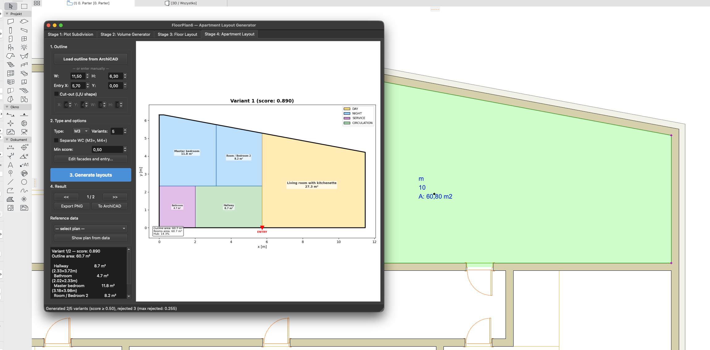
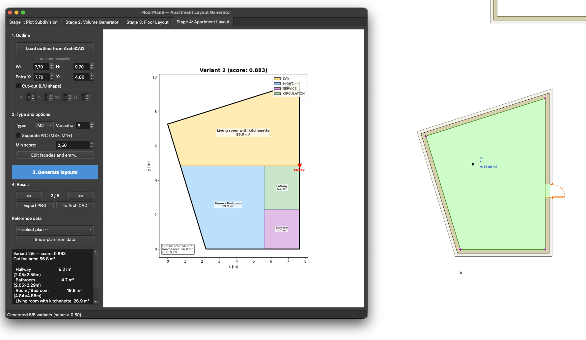
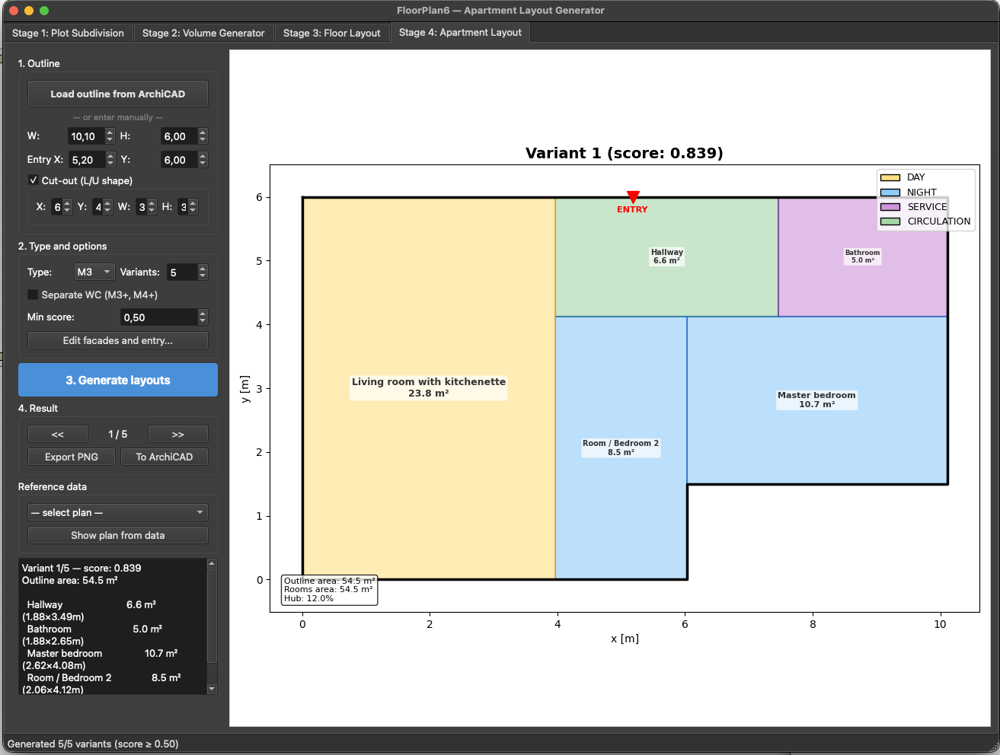
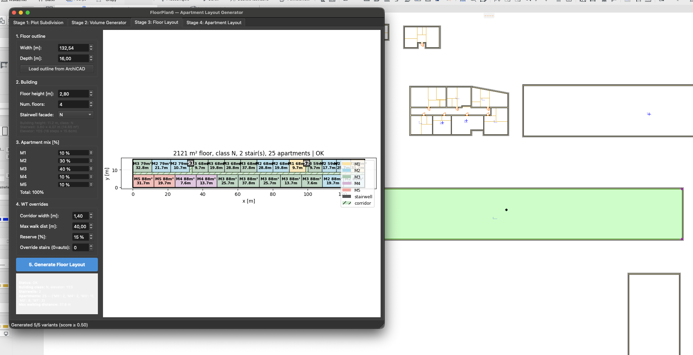
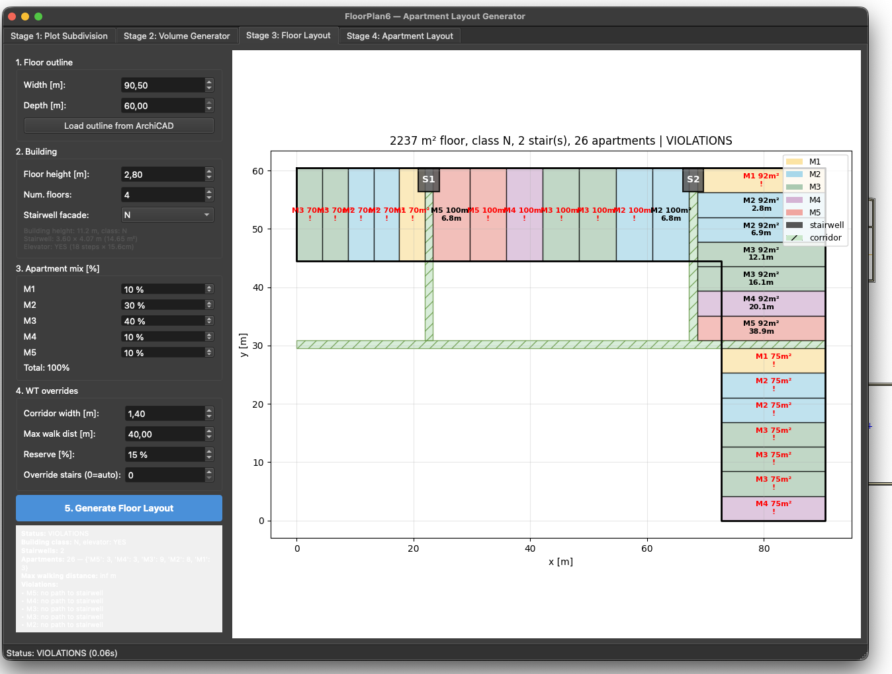
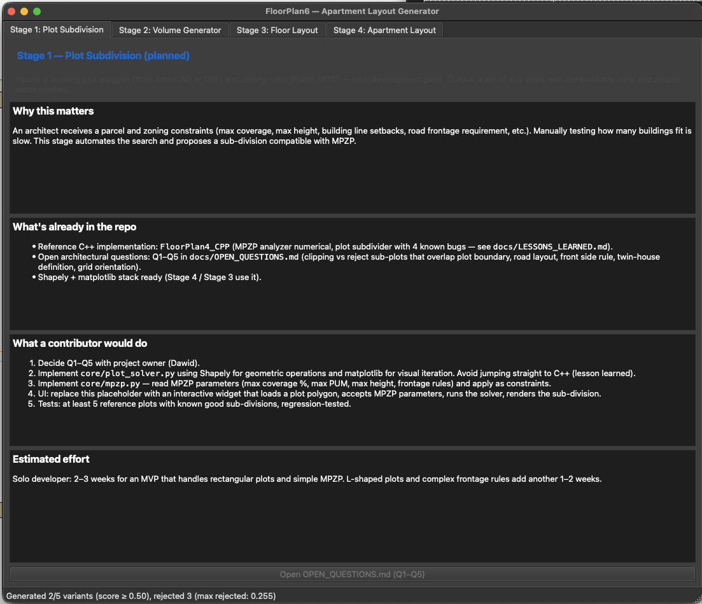
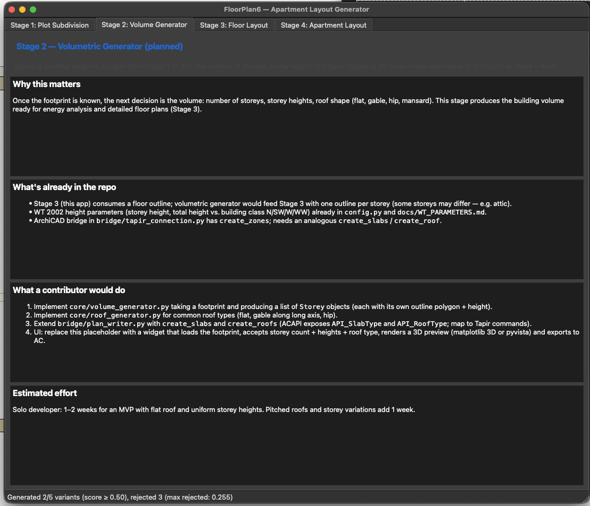

# FloorPlan6 — automatic apartment & floor layout generator

[](./LICENSE)
[](https://www.python.org/downloads/)
[](https://github.com/poolpet/floorplan6/actions/workflows/test.yml)
[](./CONTRIBUTING.md)

> **Status:** active development. Stage 4 (apartment layout) and Stage 3
> (floor layout) are functional MVPs. Stages 1 & 2 are open for contributors.
>
> **License:** AGPL-3.0 — see [LICENSE](./LICENSE). Any modified version
> distributed (including hosted as a web service) must remain open-source
> under the same license.

FloorPlan6 is a Python application that generates apartment floor plans from
an outline drawn in ArchiCAD. It enforces the Polish Building Code (WT 2002,
amended 2024-08-01) so every generated layout satisfies real-world rules:
minimum room areas, bathroom 5 m² hard cap, 1.4 m corridor width, 40 m
walking distance to staircase, and many more.

It was built to give architects a head-start on schematic design instead of
hand-placing rooms in every variant. Generated zones can be exported back
to ArchiCAD as native Zone objects via the Tapir Add-On.

## What works today

| Stage | Module | Status |
|---|---|---|
| 1. Plot subdivision | `core/plot_subdivider.py` | ✅ MVP (Mode A + Mode B, PDF report) — **frozen** since 2026-05-31 |
| 2. Volumetric generator | — | ⏸️ dropped from roadmap (see `docs/ROADMAP_domy.md`) |
| 3. Floor layout | `core/floor_layout.py` | ✅ MVP for rectangular floors — frozen |
| 4. Apartment + house layout | `core/cpsat_solver.py`, `core/house_layout.py` | ✅ apartments M1–M5, houses (single/2-storey) with furniture, export to AC (zones, walls, doors, windows, labels) |

### Stage 4 — apartment layout
- CP-SAT solver places rooms inside an outline read from ArchiCAD
- Hard rules: 100% coverage, bathroom ≤ 5 m², WC ≤ 3 m², hub ≤ 15 %
- Q6 area distribution: living room takes 80 % of excess, bedrooms 20 %
- Manual facade / entry editor (click + Shift+click on canvas)
- Variant filter by quality score; export to PNG or back to ArchiCAD
- 80/80 unit tests + regression suite passing

### Stage 3 — floor layout
- Deterministic geometry: stairwell at chosen facade for daylight, central
  corridor along the long axis, T-shape connector
- Auto stairwell count from building class (N/SW/W/WW) and corridor length
- Walking distance validated by Dijkstra on the corridor graph
- All UI controls in English

## Screenshots

### Stage 4 — apartment layout (working)

Generated layouts on outlines loaded directly from ArchiCAD via Tapir.
Colours: yellow = day zone, blue = night, purple = service, green =
circulation. Bathroom area is hard-capped at 5 m² (F2 / WT § 81).

| Trapezoidal outline (M3, 60.7 m²) | Convex polygon outline (M2, 56.8 m²) | L-shape cut-out (M3, 54.5 m²) |
|---|---|---|
|  |  |  |
| Outline picked up from an ArchiCAD Zone (60.80 m², visible in the canvas behind the GUI). Variant 1 / 5, score 0.890. Hub 14.3 %. | 5-vertex outline read from AC (57.08 m²). Variant 2 / 5, score 0.883. Hub 9.2 %. | Manually-entered 10.10 × 6.00 m outline with a 6 × 4 cut-out (W=3, H=3). Variant 1 / 5, score 0.839. Hub 12.0 %. |

### Stage 3 — floor layout

| Rectangular floor (working MVP) | L-shape floor (known limitation) |
|---|---|
|  |  |
| 132.54 × 16 m floor, 2 121 m², class N, 2 stairwells, 25 apartments. Status **OK** — max walking distance 37.6 m (under WT § 256 limit of 40 m). | 90.5 × 60 m L-shape floor. Status **VIOLATIONS** — apartments are placed in a bounding box, ignoring the cut-out, so several end up with no path to a stairwell. Tracked as `help-wanted`; see *Looking for someone to take this further* below. |

### Stage 1 / Stage 2 — placeholders

These tabs ship as informational placeholders so anyone who downloads the app
sees what's planned, what's already in the repo, and what a contributor would
need to build.

| Stage 1 — Plot Subdivision | Stage 2 — Volumetric Generator |
|---|---|
|  |  |

## Quick start

```bash
# Clone
git clone https://github.com/poolpet/floorplan6.git
cd floorplan6

# Set up environment (Python 3.10+)
python3 -m venv venv
source venv/bin/activate            # Windows: venv\Scripts\activate
pip install -r requirements.txt

# Run the GUI
PYTHONPATH=. python ui/main_window.py

# Or run the CLI on a manual outline
PYTHONPATH=. python run_archicad.py --manual --type M3 --width 10 --height 8
```

## ArchiCAD integration

1. Install the [Tapir Add-On](https://github.com/ENZYME-APD/tapir-archicad-automation)
   for ArchiCAD 27/28/29.
2. Open ArchiCAD; the Tapir HTTP listener defaults to port 19723.
3. In FloorPlan6 GUI: **Stage 4 → "Load outline from ArchiCAD"**.
4. In ArchiCAD: pick a Zone (created via Tools → Zone → Inner Edge) or
   a closed wall loop. The GUI auto-detects it.

## Documentation

| File | What's inside |
|---|---|
| [`docs/ARCHITECTURE.md`](docs/ARCHITECTURE.md) | Pipeline overview, module boundaries |
| [`docs/FUNDAMENTAL_RULES.md`](docs/FUNDAMENTAL_RULES.md) | F1–F10 design rules, B1–B10 workflow rules (inviolable) |
| [`docs/WT_PARAMETERS.md`](docs/WT_PARAMETERS.md) | All Polish Building Code parameters with paragraph references |
| [`docs/FLOOR_LAYOUT_DESIGN.md`](docs/FLOOR_LAYOUT_DESIGN.md) | Stage 3 design rationale |
| [`docs/LESSONS_LEARNED.md`](docs/LESSONS_LEARNED.md) | Patterns that worked, mistakes to avoid |
| [`docs/OPEN_QUESTIONS.md`](docs/OPEN_QUESTIONS.md) | Open architectural decisions (Q1–Q11) |
| [`docs/STATE.md`](docs/STATE.md) | Current implementation status, last update |

## How to contribute

See [`CONTRIBUTING.md`](CONTRIBUTING.md) for the full guide. Short version:

- **Read `docs/FUNDAMENTAL_RULES.md` first.** Rules F1–F10 (architectural)
  and B1–B10 (workflow) are not up for negotiation. Patches that bend a
  rule to make a solver "work" are rejected by design.
- For new features: open a GitHub Discussion before coding so we agree
  on architecture.
- For bug fixes: add a regression test alongside the fix.
- Two failed attempts on the same module → rewrite, don't keep patching
  (rule B1, learned the hard way; see `LESSONS_LEARNED.md`).

## Looking for someone to take this further?

These tabs in the UI are placeholders waiting for an architect-developer:

- **Stage 1 — Plot subdivision** (MPZP zoning rules, sub-plot layout, road
  layout). MVP estimate: 2–3 weeks. Architectural decisions Q1–Q5 in
  `docs/OPEN_QUESTIONS.md` need a green light from the project owner first.
- **Stage 2 — Volumetric generator** (3D massing from a footprint, roof
  types, slab + roof export to ArchiCAD). MVP estimate: 1–2 weeks.

Open a Discussion or a draft PR — happy to mentor.

## Project history — why Python (and not C++)

This is the 6th iteration. Earlier versions:

- **FloorPlan2 / FloorPlan3** — early Python prototypes (PyQt5 + heuristics).
  Abandoned.
- **FloorPlan4** (Python, OR-Tools CP-SAT) — first solver-based version.
  Reached **36/36 unit tests passing** with 27 reference plans containing
  geometry + adjacency graphs. Abandoned in favour of a C++ port for
  performance and tighter ArchiCAD integration.
- **FloorPlan4_CPP** (C++ ArchiCAD add-on) — the C++ port. Stage 3 floor
  mode works (6/6 tests), but Stage 4 broke badly — bathroom area grew to
  **13 m²** instead of the 5 m² hard cap (262 % over WT limit). Stage 1
  Plot Subdivider had 4 known geometry bugs after a single session.
  Diagnosed root causes in `docs/LESSONS_LEARNED.md` (lessons E1–E6).
- **FloorPlan5** — documentation-only consolidation. The "everything in C++"
  decision was reversed on 2026-04-29.
- **FloorPlan6** (this repo, Python again) — pragmatic return to Python for
  the algorithm side, with C++ kept as a reference for the UI / AC bridge.

**Why the return to Python after committing to C++:**

1. **Geometric algorithms are faster to iterate in Python.** Shapely +
   matplotlib give immediate visual feedback; a buggy clip is obvious from
   the rendered PNG. In C++ the iteration loop was: edit → recompile bundle
   → reload AC → re-test → diagnose without a quick visualiser. Plot
   Subdivider in C++ produced 4 bugs in one session because of this slow
   feedback loop.
2. **Rule enforcement was easier to lose in C++.** The bathroom-13-m² bug
   came from changing `Coverage` from `==` to `<=` and forgetting to add a
   MAX-area validator — both invisible in a fast review of C++ source.
   Python with `WT_MAX_AREA` as a config constant + a regression test makes
   the same omission impossible.
3. **OR-Tools is more idiomatic in Python.** Constraint construction reads
   like the rule it expresses; the C++ API is much heavier.
4. **The C++ work is not lost** — `FloorPlan4_CPP` is retained as the
   reference for the eventual ArchiCAD add-on UI (palette, MPZP dialog,
   `BADPOLY` zone-insertion fix). After Python stabilises, the proven
   algorithm will be ported back to C++ keeping the existing UI.

## Tech stack

- Python 3.10+ (developed against 3.13)
- [OR-Tools](https://developers.google.com/optimization) CP-SAT solver
- [Shapely 2](https://shapely.readthedocs.io/) for 2D geometry
- [matplotlib](https://matplotlib.org/) for visualization
- [PyQt5](https://pypi.org/project/PyQt5/) for the desktop GUI
- [networkx](https://networkx.org/) for shortest-path validation
- [archicad](https://pypi.org/project/archicad/) (Graphisoft official
  Python API) and Tapir Add-On for ArchiCAD bridge

## Author

Dawid Ćwiertniewicz, architect — driving the architectural requirements,
domain decisions and testing.

Co-developed with Claude Code (Anthropic) — implementation and rule
enforcement.

## License

GNU Affero General Public License v3.0. Pick this project up and improve
it freely; if you ship a derivative (including a hosted web service),
your modifications must be open-source under the same license.
